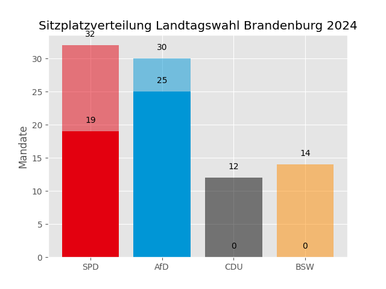

# Brandenburg Mandatsberechnung Landtagswahl 2024

Dieses Repository enthält den Code zur Berechnung der Sitzverteilung bei der Landtagswahl in Brandenburg 2024. Es implementiert den Algorithmus zur Verteilung der Mandate auf Grundlage des [Brandenburgischen Wahlgesetzes](https://bravors.brandenburg.de/gesetze/bbglwahlg), insbesondere nach den Bestimmungen von §1, 2 und 3 des Gesetzes.

## Inhalt

- `preprocess.py`: Dieses Skript bereinigt und verarbeitet die Rohdaten des Wahlleiters, um sie für die Sitzberechnung nutzbar zu machen.
- `main.py`: Berechnet die Sitzverteilung gemäß dem Verfahren in §6 Abs 3. Die Sonderregeln für Überhang- und Ausgleichsmandate sind noch nicht implementiert, da es nach vorläufigem Ergebnis keine geben wird, allerdings wirft das Programm eine Exception falls es doch welche geben würde.
- `plot.py`: Erstellt einen einfachen Plot zur Visualisierung der berechneten Sitzverteilung.

## Ergebnis 

## Abhängigkeiten

Das Projekt erfordert folgende Python-Bibliotheken:
- `pandas`
- `matplotlib`

Installiere die Abhängigkeiten mit:

`pip install pandas matplotlib`

## Lizenz

Dieses Projekt steht unter der [MIT Lizenz](LICENSE).

## Kontakt

Ersteller: Georg Lange

E-Mail: mail@georglange.com